<div align="center">



<br/>

<a href="https://github.com/minidu006"></a>
<a href="https://minidu006.github.io"></a>
<a href="https://github.com/minidu006?tab=followers"></a>


</div>

<!--
  Add your own socials here, e.g.:
  <a href="https://www.linkedin.com/in/YOUR-HANDLE"></a>
  <a href="mailto:YOUR-EMAIL"></a>
-->

<br/>

## 👨‍💻 About Me

```text
> whoami
minidu006 — software developer

> focus
Android apps · web platforms · desktop systems

> status
always building, always learning ⚡
```

- 📱 Building **Android** apps with Kotlin & Firebase
- 🌐 Crafting **full-stack web** apps with PHP, MySQL, HTML, CSS & JavaScript
- 🖥️ Shipping **desktop** tools with Java Swing
- 🌱 Exploring cleaner architecture, better UI, and new tech every week

<br/>

## 🛠️ Tech Stack

<div align="center">


<br/>


</div>

<br/>

## 📊 GitHub Stats

<div align="center">

<a href="https://github.com/minidu006">
  
</a>
<a href="https://github.com/minidu006">
  
</a>

<br/>


<br/><br/>


</div>

<br/>

## 🚀 Featured Projects

<div align="center">

<a href="https://github.com/minidu006/android-chat-app">
  
</a>
<a href="https://github.com/minidu006/library-management-system-java">
  
</a>

<a href="https://github.com/minidu006/inventory-management-system-php">
  
</a>
<a href="https://github.com/minidu006/minidu006.github.io">
  
</a>

</div>

<br/>

## 🏆 Trophies

<div align="center">


</div>

<br/>

## 🤝 Let's Connect

Open to collaborations, ideas, and cool projects. Check out my [portfolio](https://minidu006.github.io) or drop a star on something you like ⭐

<div align="center">


<sub>✨ Thanks for stopping by ✨</sub>

</div>
